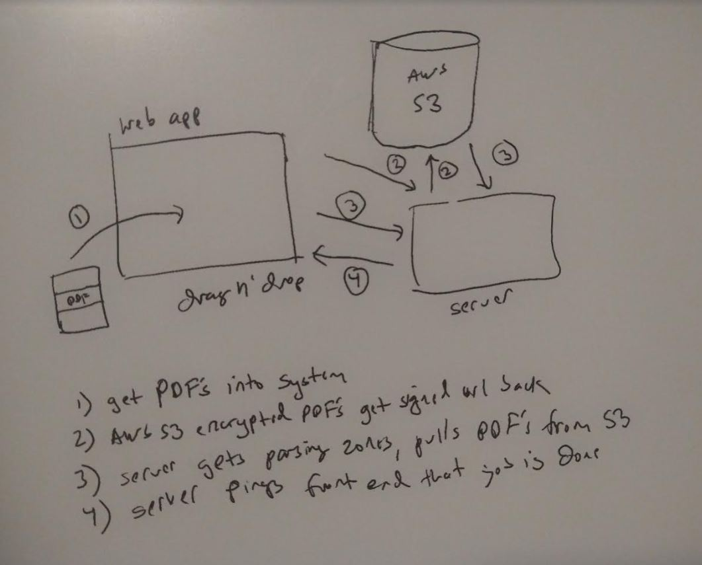

### About
This Node.js server has some API endpoints dealing with the Google Spreadsheet auth aspect, uploading PDFs (from client to Server, then to AWS S3) and downloading/generating sub-image screenshots (crops) and parsing with Tesseract.js.

A rough code tree:
* index.js
  * methods.js
  * google-spreadsshet.js
  * pdf-screenshot-gen/generator.js

The file `eng.traineddata` is generated by `Tesseract.js`

See this crude concept diagram for an idea of how it works.

