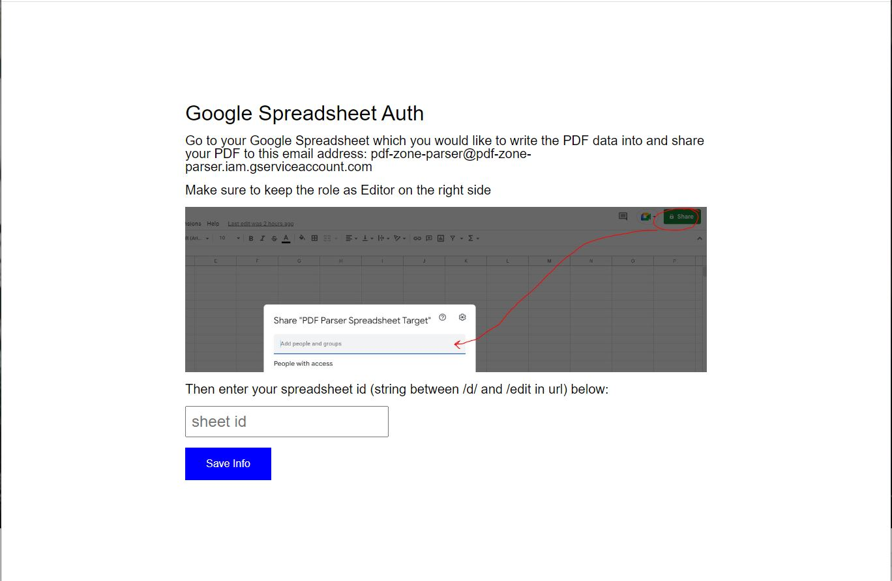
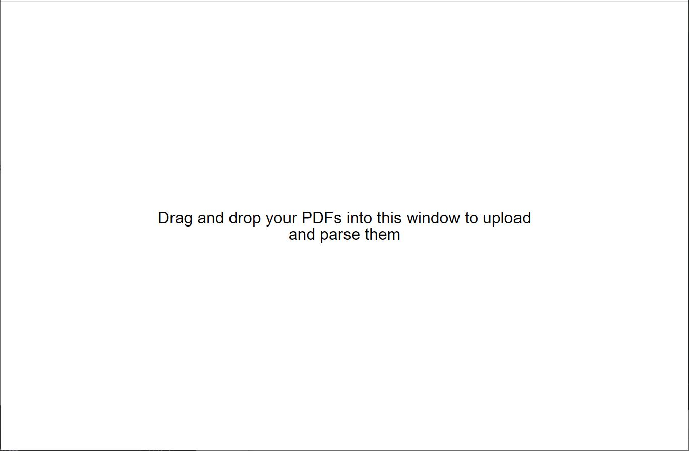
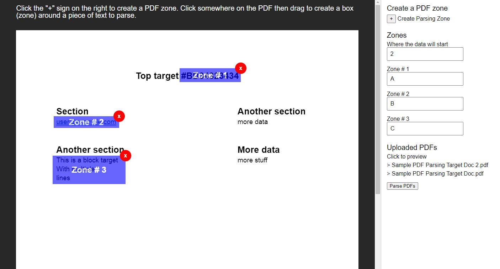

### About
The interface has three steps:

* Google Spreadsheet Auth
* PDF drag-drop upload target
* the PDF tagging/parsing

#### Step 1

#### Step 2

#### Step 3

#### Built with Create React App